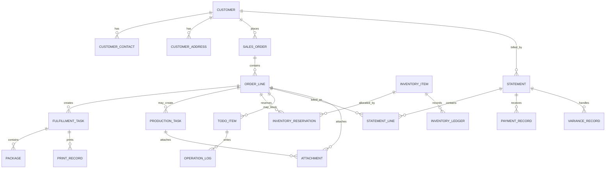

# ERP 数据模型 / API 草案

最后更新：2026-07-02

## 定位

本文是阶段 3 的第一版开发草案，用来把当前 P0 办公室端前端原型逐步对齐未来后端合同。它不锁死数据库表结构，也不替代产品需求文档。

需求源：`docs/product/requirements.zh-CN.md`

当前前端入口：`src/services/officeMockService.js`

当前假数据入口：`src/data/fixtures.js`

第一版 ERD / 表结构草案：`docs/development/erp-erd-draft.zh-CN.md`

机器可读接口草案：`docs/development/erp-api-openapi-draft.yaml`

## 建模原则

- 原始订单只做汇总和追溯，订单明细是主要状态对象。
- 业务主状态和异常标签分开，异常不覆盖主流程状态。
- 金额、库存、交付、权限相关动作必须写操作日志。
- 已交付后的历史不直接回退，通过调整、售后、补发、作废重打、收款差额等记录处理。
- 库存可用量按 `在库 - 已占用 - 待提货锁定 - 待处理/报废` 计算。
- P0 先服务办公室端六页，不先做完整多账套、多公司和复杂多仓。

## 核心实体草案

## 实体字段第一版

| 实体 | 关键字段 | 说明 |
|---|---|---|
| `Customer` | `id`, `name`, `settlementCycle`, `riskStatus`, `debtAmount`, `tags` | 客户主体，后续接价格表和欠款规则 |
| `CustomerContact` | `customerId`, `name`, `phone`, `role`, `isDefault` | 联系人和电话，支持多个 |
| `CustomerAddress` | `customerId`, `address`, `deliveryType`, `isDefault` | 自提、送货、快运可复用 |
| `SalesOrder` | `id`, `sourceText`, `customerId`, `summaryStatus`, `createdBy`, `createdAt` | 原始订单，保存粘贴原文和汇总状态 |
| `OrderLine` | `id`, `orderId`, `productName`, `size`, `bagColor`, `handleType`, `style`, `qty`, `printFlag`, `printColor`, `printSide`, `handleColor`, `latestNeededAt`, `lineStatus`, `exceptionTags` | 主状态对象 |
| `PriceSnapshot` | `orderLineId`, `bagPrice`, `printPrice`, `otherFee`, `amount`, `priceVersion` | 保存确认时的价格快照 |
| `InventoryItem` | `size`, `color`, `handleType`, `style`, `zone`, `state`, `qty`, `trustLevel` | 库存真实键 |
| `InventoryReservation` | `orderLineId`, `inventoryItemId`, `qty`, `status` | 占用、释放和待提货锁定 |
| `InventoryLedger` | `inventoryItemId`, `changeType`, `qtyBefore`, `qtyChange`, `qtyAfter`, `reason`, `operatorId` | 库存流水 |
| `TodoItem` | `type`, `refType`, `refId`, `summary`, `urgency`, `latestAt`, `handled`, `reminderAt`, `handledBy` | 公共待办 |
| `ProductionTask` | `orderLineId`, `taskType`, `machineId`, `plannedQty`, `reportedQty`, `taskStatus`, `exceptionTags` | 丝印、制袋、备料、打包等后续扩展 |
| `FulfillmentTask` | `orderLineId`, `method`, `status`, `expectedQty`, `actualQty`, `packages`, `latestAt` | 自提、送货、快递快运 |
| `Package` | `fulfillmentId`, `packageNo`, `qty`, `labelStatus`, `zone` | 包裹明细 |
| `PrintRecord` | `targetType`, `targetId`, `templateId`, `batchNo`, `status`, `printedBy`, `printedAt`, `voidReason` | 出库单、送货单、标签、对账单 |
| `Statement` | `customerId`, `period`, `status`, `receivable`, `received`, `variance`, `sentAt` | 对账单 |
| `StatementLine` | `statementId`, `orderLineId`, `billQty`, `amount`, `adjustment`, `remark` | 对账明细 |
| `PaymentRecord` | `statementId`, `amount`, `paidAt`, `method`, `confirmedBy`, `attachmentIds` | 收款记录 |
| `VarianceRecord` | `statementId`, `amount`, `handlingResult`, `reason`, `confirmedBy` | 差额处理 |
| `Attachment` | `ownerType`, `ownerId`, `fileType`, `url`, `uploadedBy`, `status`, `metadata` | 印刷图、成品图、付款截图、水印照片等；水印照片 metadata 保存水印编号、时间、地址、定位快照和水印图片生成状态 |
| `OperationLog` | `targetType`, `targetId`, `action`, `before`, `after`, `reason`, `operatorId`, `createdAt` | 所有关键动作留痕 |

## 状态字典第一版

| 对象 | P0 状态 |
|---|---|
| 原始订单 | `待确认`, `处理中`, `部分完成`, `全部完成`, `已取消`, `异常处理中` |
| 订单明细 | `草稿`, `待确认`, `待排产`, `已排产`, `丝印中`, `待制袋`, `制袋中`, `待打包`, `待出库`, `待交付确认`, `待交付`, `已交付`, `已关闭` |
| 异常标签 | `信息待补`, `库存不足`, `数量差异`, `生产异常`, `照片待重拍`, `待客户确认`, `售后处理中`, `责任待确认` |
| 库存状态 | `仓库已清点`, `车间报数/散装`, `已占用`, `待提货锁定`, `待处理/报废`, `估算/待复核` |
| 交付状态 | `待出库`, `已备货`, `待打印标签`, `待确认拉走`, `已交付`, `数量差异待处理`, `无法出库` |
| 对账状态 | `待生成`, `待发送`, `已发送`, `收款待确认`, `差额待确认`, `有欠款`, `已核销`, `已确认欠款` |
| 打印状态 | `未打印`, `已打印`, `已作废`, `已重打` |
| 待办状态 | `未处理`, `已处理`, `稍后提醒`, `已重新打开` |

## API 草案优先级

### 1. 工作台初始化

| 项 | 草案 |
|---|---|
| API | `GET /api/office/workspace` |
| 请求 | `scenarioId?`, `date?` |
| 响应 | 当前用户、客户列表摘要、订单明细、库存摘要、待办、出库任务、对账列表、默认选中项 |
| 权限 | 办公室、生产管理、管理查看 |
| 日志 | 不写操作日志，只写访问审计可选 |
| 当前前端映射 | `loadOfficeWorkspace()` |

### 2. 订单录入 / 识别

| API | 请求 | 响应 | 副作用 |
|---|---|---|---|
| `POST /api/order-drafts/recognize` | `sourceText`, `customerHint?` | `draftId`, `draftLines`, `confidence`, `missingFields` | 不占库存 |
| `PATCH /api/order-drafts/{id}` | `sourceText`, `draftLines`, `clientRevision` | `draft`, `todoId?` | 保存草稿，不占库存 |
| `POST /api/order-drafts/{id}/confirm` | `draftLines`, `confirmOptions` | `orderId`, `orderLines`, `reservations`, `todos`, `priceSnapshots` | 写订单、占库存、生成出库或缺货待办 |

错误状态：
- `MISSING_REQUIRED_FIELD`
- `INVENTORY_NOT_ENOUGH`
- `PRICE_NEEDS_REVIEW`
- `CUSTOMER_NEEDS_MANAGEMENT_CONFIRM`

### 3. 订单池

| API | 请求 | 响应 | 说明 |
|---|---|---|---|
| `GET /api/order-lines` | `customerId`, `status`, `orderType`, `fulfillment`, `exception`, `finance`, `dateRange`, `includeHistory` | 分页订单明细列表 | 默认近 30 天未完成 + 今日完成 |
| `GET /api/order-lines/{id}` | 无 | 明细、原始订单、生产、库存、交付、对账、日志 | 右侧详情页数据 |
| `POST /api/order-lines/{id}/void` | `reason`, `reasonText?`, `operatorId` | `status`, `releasedReservations`, `canceledFulfillmentIds`, `inventoryLedgerIds`, `orderLineChangeRecordId`, `operationLogId` | 只允许未生产、未交付、未关闭的正式明细作废；同步释放库存占用 |
| `POST /api/order-lines/{id}/quantity-adjustment` | `newQty`, `reason`, `reasonText?`, `operatorId` | `previousQty`, `newQty`, `qtyDelta`, `adjustedReservations`, `adjustedFulfillmentIds`, `inventoryLedgerIds`, `orderLineChangeRecordId`, `operationLogId` | 只允许未生产、未交付、未关闭的正式明细改量；减量释放占用，增量重查可用库存并补占用 |

`POST /api/order-lines/{id}/void` 副作用：

- 更新 `OrderLine.lineStatus` 为 `已关闭`，记录 `voidedAt / voidedBy / voidReason`。
- 取消该明细未交付的 `FulfillmentRecord`。
- 释放该明细仍生效的 `InventoryReservation`，扣减 `inventory_items.reserved_qty`。
- 写 `InventoryLedger`、`OrderLineChangeRecord` 和 `OperationLog`。

`POST /api/order-lines/{id}/quantity-adjustment` 副作用：

- 更新 `OrderLine.originalQty`，保留当前主状态，不直接覆盖生产 / 交付历史。
- 同步该明细未交付且未取消的 `FulfillmentRecord.expectedQty`。
- 减量时按差额释放仍生效的 `InventoryReservation`，并扣减 `inventory_items.reserved_qty`。
- 增量时要求存在生效 reservation，先按 `在库 - 已占用 - 待提货锁定 - 待处理` 重新检查可用量，足够时补占用。
- 写 `InventoryLedger`、`OrderLineChangeRecord` 和 `OperationLog`。

### 4. 库存查询 / 修正

| API | 请求 | 响应 | 副作用 |
|---|---|---|---|
| `GET /api/inventory/items` | `size`, `color`, `handleType`, `style`, `state`, `trustLevel`, `keyword` | 库存项、可用量、参考库存 | 无 |
| `POST /api/inventory/correction-drafts` | `inventoryItemId`, `expectedQty`, `actualQty`, `reason`, `remark` | `draftId`, `status` | 生成待确认草稿 |
| `POST /api/inventory/correction-drafts/{id}/confirm` | `approvalReason` | 库存流水、最新库存 | 需要库存调整权限 |

### 5. 出库 / 交付

| API | 请求 | 响应 | 副作用 |
|---|---|---|---|
| `GET /api/fulfillments` | `method`, `status`, `date`, `exceptionOnly` | 出库/交付列表和统计 | 无 |
| `POST /api/fulfillments/{id}/print` | `templateId`, `packageIds?` | `printRecord`, `nextStatus` | 写打印记录 |
| `POST /api/fulfillments/{id}/complete` | `actualQty`, `handoverEvidence?` | `status`, `statementCandidate?` | 更新交付，可能进入对账 |
| `POST /api/fulfillments/{id}/exception` | `type`, `actualQty?`, `reason`, `remark` | `status`, `todoId` | 生成办公室待办 |
| `POST /api/fulfillments/{id}/pickup-confirm` | `pickedAt`, `operatorId` | `status` | 快递快运确认拉走 |
| `POST /api/fulfillments/{id}/cancel` | `reason`, `reasonText?`, `operatorId` | `status`, `releasedReservations`, `inventoryLedgerIds`, `operationLogId` | 取消未交付出库任务，释放仍生效的库存占用，不关闭订单明细 |
| `POST /api/fulfillments/{id}/delivery-evidence-review` | `reviewStatus`, `operatorId`, `reviewerName?`, `reason?`, `reviewedAt?` | `reviewStatus`, `reviewedAt`, `reviewedBy`, `todoId?`, `operationLogId` | 办公室复核司机送达水印照片；可标记已复核，或退回需重拍并生成/复用照片待重拍待办 |
| `GET /api/driver/delivery-tasks` | `status?`, `date?` | `tasks`, `metrics` | 司机手机端送货任务列表 |
| `GET /api/driver/delivery-tasks/{id}` | 无 | `task` | 单条司机送货任务详情 |
| `POST /api/driver/delivery-tasks/{id}/load-confirm` | `checkedAt?`, `remark?` | `task`, `operationLogId` | 司机确认装车，待送货转配送中 |
| `POST /api/driver/delivery-tasks/{id}/complete` | `actualQty?`, `receiverName?`, `watermarkedPhotoAttached`, `watermarkedPhotoAttachmentId?`, `watermarkId?`, `watermarkText?`, `watermarkCapturedAt?`, `watermarkLocationLabel?`, `watermarkGeoPoint?`, `signaturePhotoAttached?`, `signaturePhotoAttachmentId?`, `paperNoteStatus?`, `remark?` | `task`, `statementCandidate`, `operationLogId` | 司机送达完成，必须有水印照片证据；水印照片可用附件 ID 证明，并保存水印编号、时间、地址、定位快照和附件 metadata |
| `POST /api/driver/delivery-tasks/{id}/exception` | `reason`, `remark?` | `task`, `todoId`, `operationLogId` | 司机上报装车 / 送货异常 |

### 5A. 生产报工 / 打包完成

| API | 请求 | 响应 | 副作用 |
|---|---|---|---|
| `POST /api/production-tasks/{id}/report-complete` | `orderLineId?`, `qualifiedQty`, `exceptionQty?`, `machineCount?`, `machineId?`, `inventoryItemId?`, `createPackingTask?`, `operatorId`, `completedAt?` | `productionTaskId`, `reportId`, `orderLineStatus`, `qualifiedQty`, `machineCountAffectsInventory=false`, `reservationId`, `packingTaskId`, `inventoryLedgerIds`, `operationLogId` | 合格数量入成品库存并占用给订单；机器计数仅作凭证；可同步生成打包任务 |
| `POST /api/packing-tasks/{id}/complete` | `orderLineId?`, `actualPackedQty`, `packageCount?`, `packages?`, `labelsPrinted?`, `inventoryItemId?`, `operatorId`, `completedAt?` | `packingTaskId`, `packageIds`, `orderLineStatus`, `inventoryDeducted=false`, `inventoryLedgerIds`, `operationLogId` | 完成打包并生成包裹明细；只写零数量追踪流水，不扣减库存 |

生产报工完成副作用：

- 更新 `ProductionTask.taskStatus=已完成`，写 `WorkshopReport`。
- 只有 `qualifiedQty` 会增加 `inventory_items.on_hand_qty` 并增加该订单明细的 `inventory_reservations.reserved_qty`。
- 写两条库存流水：`production_report` 表示合格入库，`production_report_reservation` 表示生产完成后锁定给订单明细。
- `machineCount` 保存为机器计数 / 动作次数证据，不参与库存、交付、计费或工资数量。

打包完成副作用：

- 更新 `PackingTask.status=已完成`，写实际打包数量和包裹明细。
- 快递 / 快运未打标签时进入 `待打印标签`，已打标签时进入 `待快运拉走` / `待确认拉走`。
- 写 `packing_complete` 零数量库存追踪流水，表示货已打包但仍保持库存占用。
- 不扣减 `inventory_items.on_hand_qty` 或 `reserved_qty`；扣减仍由完成出库或快递 / 快运确认拉走接口处理。

### 6. 对账 / 收款

| API | 请求 | 响应 | 副作用 |
|---|---|---|---|
| `GET /api/statements/customers` | `status`, `keyword`, `period` | 客户维度对账列表 | 无 |
| `GET /api/statements/{id}` | 无 | 对账单、明细、收款、差额、日志 | 无 |
| `POST /api/statements/{id}/preview` | `templateId?` | 预览数据、`downloadToken` | P0 先浏览器预览，并通过导出仓储登记 `statement_lines`、导出元数据 / 文件内容和操作日志 |
| `GET /api/statements/{id}/exports` | 无 | 导出记录摘要列表，不含文件内容 | 查询客户发送 / 内部留档导出文件状态 |
| `GET /api/statements/{id}/exports/{downloadToken}` | 无 | `.xlsx` 对账导出文件 | P0 先从导出对象存储 / 文件仓储返回第一版双 sheet Excel 模板文件 |
| `POST /api/statements/{id}/mark-sent` | `channel`, `sentAt`, `remark` | `status`, `operationLogId` | 写发送记录 |
| `POST /api/statements/{id}/send-receipt` | `sendRecordId?`, `receiptStatus`, `receiptAt`, `operatorId`, `remark` | `sendRecordId`, `receiptStatus`, `operationLogId` | 登记客户已送达 / 已读 / 已确认 / 未回复回执，不自动确认收款 |
| `POST /api/statements/{id}/customer-confirmation` | `sendRecordId?`, `confirmedByCustomer`, `content`, `attachmentIds?`, `operatorId` | `status`, `sendRecordId`, `receiptStatus`, `confirmationRecord`, `operationLogId` | 登记客户回复确认对账无误，保存独立确认证据并把发送回执升级为已确认，不自动确认收款 |
| `POST /api/statements/{id}/payments` | `amount`, `paidAt`, `method`, `attachmentIds?`, `remark` | `payment`, `status`, `todoId?` | 少付生成差额待办 |
| `POST /api/statements/{id}/variance` | `amount`, `handlingResult`, `reason` | `varianceRecord`, `status`, `todoId?` | 差额处理 |
| `POST /api/statements/{id}/write-off` | `confirmReason` | `status`, `operationLogId` | 需收款确认权限 |

### 7. 登录 / 附件 / 待办 / 权限 / 操作日志

| API | 请求 | 响应 | 说明 |
|---|---|---|---|
| `POST /api/auth/login` | `loginName/userId`, `password` | `session`, `permissions` | seed 登录入口，后续替换为正式账号表和密码策略 |
| `GET /api/auth/me` | bearer token | 当前会话、账号、角色、按钮权限、动作权限 | 前端初始化当前登录态 |
| `POST /api/auth/logout` | bearer token | `loggedOut`, `tokenRevoked` | P0 seed token 暂无状态撤销 |
| `POST /api/attachments` | `ownerType`, `ownerId`, `file`, `fileType`, `metadata?` | `attachmentId`, `url`, `status`, `metadata` | 印刷图、成品图、付款截图、送货水印照；送货水印照可上传前端已叠加水印的 JPEG |
| `GET /api/todos` | `status`, `type`, `priority`, `keyword` | 公共待办列表 | 默认未处理，按急单/异常/今天/最晚时间排序 |
| `POST /api/todos/{id}/handle` | `action`, `reason?`, `snoozeUntil?` | `todo`, `operationLogId` | 只处理待办状态，业务动作仍走对应接口 |
| `GET /api/permissions/effective` | 无 | 当前账号、角色、按钮权限、动作权限 | 前端显示按钮，后端仍逐接口校验 |
| `GET /api/operation-logs` | `targetType`, `targetId`, `limit` | 日志列表 | 所有关键动作可追溯 |

## 字段级合同第一轮

本节先把最容易影响库存、金额、交付和责任追溯的四类 API 写到可评审字段级。字段名是实现草案，后端落地时可以按框架习惯调整命名，但业务语义不能变。

对应 OpenAPI 草案见 `docs/development/erp-api-openapi-draft.yaml`，当前包含 42 个路径：

- `POST /api/auth/login`
- `GET /api/auth/me`
- `POST /api/auth/logout`
- `POST /api/order-drafts/recognize`
- `PATCH /api/order-drafts/{draftId}`
- `POST /api/order-drafts/{draftId}/confirm`
- `GET /api/order-lines`
- `GET /api/order-lines/{orderLineId}`
- `POST /api/order-lines/{orderLineId}/void`
- `POST /api/order-lines/{orderLineId}/quantity-adjustment`
- `GET /api/inventory/items`
- `POST /api/inventory/reservations`
- `POST /api/inventory/reservations/{reservationId}/release`
- `POST /api/inventory/correction-drafts`
- `POST /api/inventory/correction-drafts/{correctionDraftId}/confirm`
- `POST /api/production-tasks/{productionTaskId}/report-complete`
- `POST /api/packing-tasks/{packingTaskId}/complete`
- `GET /api/fulfillments`
- `POST /api/fulfillments/{fulfillmentId}/exception`
- `POST /api/fulfillments/{fulfillmentId}/print`
- `POST /api/fulfillments/{fulfillmentId}/complete`
- `POST /api/fulfillments/{fulfillmentId}/pickup-confirm`
- `POST /api/fulfillments/{fulfillmentId}/cancel`
- `GET /api/driver/delivery-tasks`
- `GET /api/driver/delivery-tasks/{fulfillmentId}`
- `POST /api/driver/delivery-tasks/{fulfillmentId}/load-confirm`
- `POST /api/driver/delivery-tasks/{fulfillmentId}/complete`
- `POST /api/driver/delivery-tasks/{fulfillmentId}/exception`
- `GET /api/statements/customers`
- `GET /api/statements/{statementId}`
- `POST /api/statements/{statementId}/preview`
- `GET /api/statements/{statementId}/exports`
- `GET /api/statements/{statementId}/exports/{downloadToken}`
- `POST /api/statements/{statementId}/mark-sent`
- `POST /api/statements/{statementId}/send-receipt`
- `POST /api/statements/{statementId}/customer-confirmation`
- `POST /api/statements/{statementId}/payments`
- `POST /api/statements/{statementId}/variance`
- `POST /api/statements/{statementId}/write-off`
- `POST /api/print-records`
- `POST /api/print-records/{printRecordId}/void`
- `POST /api/attachments`
- `GET /api/todos`
- `POST /api/todos/{todoId}/handle`
- `GET /api/permissions/effective`
- `GET /api/operation-logs`

### A. 订单确认：`POST /api/order-drafts/{id}/confirm`

用途：把已识别草稿转成正式原始订单和订单明细。正式生成前必须重新校验库存、价格和关键字段，不能直接信任识别时快照。

请求：

| 字段 | 类型 | 必填 | 说明 |
|---|---|---:|---|
| `draftId` | string | 是 | 草稿 ID，路径和 body 保持一致时通过 |
| `sourceText` | string | 是 | 客户原文 / 手工录入原文，正式订单继续保留 |
| `sourceChannel` | enum | 否 | `manual`, `wechat`, `wecom`, `phone`, `onsite` |
| `sourceMessageId` | string | 否 | 企业微信 / 微信复制来源的消息 ID，占位 |
| `customerId` | string | 是 | 确认后的客户 |
| `operatorId` | string | 是 | 当前确认人 |
| `confirmMode` | enum | 是 | `confirm_now`, `save_pending_fulfillment`, `save_draft_only` |
| `lines` | array | 是 | 草稿明细，至少一行 |
| `lines[].draftLineId` | string | 是 | 草稿行 ID |
| `lines[].productName` | string | 是 | 品名 / 印刷内容 / 发货显示名 |
| `lines[].orderType` | enum | 是 | `stock`, `custom_print`, `external_print`, `replenishment` |
| `lines[].size` | string | 是 | 标准尺寸 / 型号 |
| `lines[].bagColor` | string | 是 | 袋子颜色，现货库存匹配主字段 |
| `lines[].handleType` | string | 是 | 普通提 / 加长提等 |
| `lines[].style` | string | 是 | 空白袋 / 小熊袋等成品款式或底袋款式 |
| `lines[].qty` | number | 是 | 客户原始下单数量 |
| `lines[].fulfillmentMethod` | enum | 否 | `pickup`, `delivery`, `express_ltl`, `pending` |
| `lines[].latestNeededAt` | datetime | 否 | 最晚要货时间 |
| `lines[].printFlag` | boolean | 是 | 是否印刷 |
| `lines[].printColor` | string | 条件 | 定制印刷必填 |
| `lines[].printSide` | enum | 条件 | `single`, `double`；定制印刷必填 |
| `lines[].handleColor` | string | 否 | 提手颜色，如黑色提手 |
| `lines[].artworkStatus` | enum | 条件 | `uploaded`, `pending`, `side_panel_required`；定制印刷必须不是 `pending` 才能正式确认 |
| `lines[].customerNote` | string | 否 | 客户备注 |
| `lines[].officeNote` | string | 否 | 办公室备注 |
| `lines[].recognitionEvidence` | object | 否 | 原文片段、置信度、识别规则 |
| `clientRevision` | number | 是 | 草稿版本号，用于避免多人同时确认覆盖 |

响应：

| 字段 | 类型 | 说明 |
|---|---|---|
| `orderId` | string | 原始订单业务号 |
| `orderSummaryStatus` | string | 原始订单汇总状态 |
| `orderLines` | array | 正式订单明细 |
| `orderLines[].id` | string | 明细业务号 |
| `orderLines[].lineStatus` | string | `待出库`, `待交付确认`, `待排产`, `待确认` 等 |
| `orderLines[].exceptionTags` | array | `库存不足`, `信息待补`, `待客户确认` 等 |
| `priceSnapshots` | array | 每行确认时价格快照 |
| `inventoryChecks` | array | 每行库存复核结果，包含识别时可用量和当前可用量 |
| `reservations` | array | 成功占用的库存记录 |
| `fulfillmentTasks` | array | 已创建的出库 / 交付任务 |
| `todos` | array | 缺货、信息待补、待确认等办公室待办 |
| `operationLogIds` | array | 订单确认、占用、价格快照、待办创建等日志 |

错误码：

| 错误码 | 触发条件 | 前端处理 |
|---|---|---|
| `DRAFT_VERSION_CONFLICT` | 草稿版本不是最新 | 提示刷新草稿 |
| `MISSING_REQUIRED_FIELD` | 订单类型对应的关键字段缺失 | 高亮行字段，不能正式确认 |
| `CUSTOM_PRINT_ARTWORK_REQUIRED` | 定制印刷缺印刷图 / 稿件 | 停留草稿，进入补资料 |
| `INVENTORY_RECHECK_CHANGED` | 当前可用库存和识别时快照不同 | 展示差异，让办公室重新选择 |
| `INVENTORY_NOT_ENOUGH` | 库存不足且不能直接进入出库 | 生成缺货 / 客户确认待办 |
| `PRICE_NEEDS_REVIEW` | 缺价格或价格覆盖需要权限 | 进入价格确认 / 管理查看 |
| `CUSTOMER_NEEDS_MANAGEMENT_CONFIRM` | 欠款、风险或管理确认客户 | 生成管理查看或拦截确认 |

状态和副作用：

- 新建 `SalesOrder`、`OrderLine`、`PriceSnapshot`。
- 现货有可信库存时创建 `InventoryReservation`，库存可用量实时下降。
- 交付方式明确且可出库时创建 `FulfillmentTask`；交付方式缺失时进入 `待交付确认` 和公共待办。
- 库存不足行不自动生成普通生产单，先进入办公室 / 客户确认。
- 写 `OperationLog`：确认订单、价格快照、库存复核、库存占用、待办创建。

当前后端骨架：

- `POST /api/order-drafts/{id}/confirm` 已接入订单确认事务仓储；PostgreSQL 模式会把 `original_orders`、`order_lines`、`price_snapshots`、`fulfillment_records`、`inventory_reservations`、`inventory_ledger_entries`、缺货 `todos` 和确认 `operation_logs` 放在一个事务内提交，并更新 `inventory_items.reserved_qty`。
- `GET /api/order-lines` 和 `GET /api/order-lines/{id}` 已接入订单池读取仓储；PostgreSQL 模式会从正式订单、订单明细、最新价格、出库记录、库存占用和对账状态生成列表 / 详情读模型，本地模式继续读 P0 workspace 投影。
- `POST /api/order-lines/{id}/void` 已接入订单明细作废事务仓储；PostgreSQL 模式会把订单明细关闭、出库任务取消、库存占用释放、库存流水、订单变更记录和操作日志放在一个事务内提交。
- `POST /api/order-lines/{id}/quantity-adjustment` 已接入订单明细改量事务仓储；PostgreSQL 模式会把订单数量、未交付出库任务数量、库存占用增减、库存流水、订单变更记录和操作日志放在一个事务内提交。
- `POST /api/fulfillments/{id}/cancel` 已接入出库动作事务仓储；PostgreSQL 模式会取消未交付出库任务，释放该订单明细仍生效的库存占用，写 `fulfillment_cancel` 库存流水和操作日志，但不关闭订单明细。
- `POST /api/production-tasks/{id}/report-complete` 和 `POST /api/packing-tasks/{id}/complete` 已接入生产 / 打包事务仓储；PostgreSQL 模式会把生产报工、合格入库、订单占用、打包任务、包裹明细、库存流水和操作日志按业务动作分别放在事务内提交。打包完成只追踪不扣库。

当前前端映射：

- `src/services/officeMockService.js`：`confirmOfficeDraftOrder(...)`
- `src/state/officeOrderActions.js`：本地计算正式订单、出库任务、库存占用和缺货待办。

### B. 库存占用 / 释放：订单确认内嵌 + 后续独立 API

P0 前端当前把库存占用放在订单确认流程内；真实后端建议保留独立库存 API，供订单改量、取消、交付完成、待提货锁定等场景复用。

#### `POST /api/inventory/reservations`

请求：

| 字段 | 类型 | 必填 | 说明 |
|---|---|---:|---|
| `orderLineId` | string | 是 | 订单明细 |
| `inventoryItemId` | string | 是 | 精确库存键 |
| `qty` | number | 是 | 占用数量，必须大于 0 |
| `reservationType` | enum | 是 | `outbound`, `waiting_pickup`, `pending_fulfillment` |
| `reason` | string | 是 | `order_confirm`, `fulfillment_pending`, `manual_hold` |
| `expiresAt` | datetime | 否 | V1 普通待交付确认不自动释放，可为空 |
| `operatorId` | string | 是 | 操作人 |

响应：

| 字段 | 类型 | 说明 |
|---|---|---|
| `reservationId` | string | 占用记录 |
| `inventoryItemId` | string | 库存项 |
| `qtyReserved` | number | 实际占用 |
| `qtyBefore` | object | 占用前 `onHand/reserved/available/waitingPickupLocked/pendingHandling` |
| `qtyAfter` | object | 占用后数量 |
| `ledgerId` | string | 库存流水 |
| `operationLogId` | string | 操作日志 |

错误码：

| 错误码 | 触发条件 |
|---|---|
| `INVENTORY_ITEM_NOT_FOUND` | 库存项不存在 |
| `INVENTORY_STATE_NOT_RESERVABLE` | 待处理 / 报废 / 估算未复核库存不能正常占用 |
| `AVAILABLE_QTY_NOT_ENOUGH` | 可用量不足 |
| `ORDER_LINE_NOT_RESERVABLE` | 明细状态不允许占用 |
| `DUPLICATE_ACTIVE_RESERVATION` | 同一明细重复占用，需要先调整或释放 |

#### `POST /api/inventory/reservations/{reservationId}/release`

请求字段：`releaseQty`, `reason`, `operatorId`, `relatedActionId?`。

释放原因：`order_cancelled`, `qty_changed`, `customer_rejected`, `manual_release`, `reservation_correction`。

响应字段：

| 字段 | 类型 | 说明 |
|---|---|---|
| `reservationId` | string | 占用记录 |
| `orderLineId` | string | 关联订单明细 |
| `inventoryItemId` | string | 库存项 |
| `qty` | number | 释放后的剩余占用数量 |
| `releasedQty` | number | 本次释放数量 |
| `status` | enum | `partially_released` 或 `released` |
| `ledgerId` | string | 库存释放流水 |
| `operationLogId` | string | 操作日志 |

副作用：

- 更新 `InventoryReservation.status` 为部分释放或已释放。
- 写 `InventoryLedger`，扣减 `reserved` 占用；可用量由库存计算自然恢复。
- 写 `OperationLog`，记录释放原因、前后数量和关联订单。

说明：完成出库不走这个释放接口；它由出库动作事务统一处理 reservation 状态、在库扣减和出库流水。新单默认必须通过 reservation 扣减；旧单 / 导入单没有 reservation 明细时，只有请求显式传 `allowUnreservedInventoryDeduction=true` 或 `inventoryDeductionPolicy=legacy_stock_match`，且系统能唯一匹配库存项、库存足够、订单类型属于现货 / 通货时，才允许由出库动作事务直接扣在库并写 `fulfillment_complete_legacy` / `fulfillment_pickup_legacy` 库存流水。

当前前端映射：

- `src/state/officeOrderActions.js`：`applyDraftInventoryReservations(...)`
- 后续应迁移为 `src/services/officeMockService.js` 内的占用 / 释放模拟方法。

### C. 出库异常：`POST /api/fulfillments/{id}/exception`

用途：处理数量不符、无法出库、标签 / 单据问题等。出库员不能直接改订单数量或库存总数，异常必须进入办公室待办。

请求：

| 字段 | 类型 | 必填 | 说明 |
|---|---|---:|---|
| `fulfillmentId` | string | 是 | 出库 / 交付任务 |
| `orderLineId` | string | 是 | 关联明细 |
| `exceptionType` | enum | 是 | `quantity_mismatch`, `unable_to_outbound`, `label_issue`, `document_issue` |
| `expectedQty` | number | 是 | 应出数量 |
| `actualQty` | number | 条件 | 数量不符必填，无法出库可为 0 |
| `reasonCode` | enum | 是 | `stock_shortage`, `not_found`, `wrong_color_or_size`, `packing_label_issue`, `customer_change`, `other` |
| `remark` | string | 否 | 补充说明 |
| `attachmentIds` | array | 否 | 现场照片、包装问题图等 |
| `operatorId` | string | 是 | 报异常账号 |
| `occurredAt` | datetime | 是 | 现场发生时间 |

响应：

| 字段 | 类型 | 说明 |
|---|---|---|
| `fulfillmentId` | string | 当前任务 |
| `status` | string | `数量差异待处理` 或 `无法出库` |
| `todoId` | string | 办公室待办 |
| `todoType` | string | `数量差异待处理` / `无法出库待处理` |
| `inventoryHoldStatus` | string | 原库存占用保持、释放或待复核 |
| `operationLogId` | string | 操作日志 |

错误码：

| 错误码 | 触发条件 |
|---|---|
| `FULFILLMENT_NOT_FOUND` | 交付任务不存在 |
| `FULFILLMENT_ALREADY_COMPLETED` | 已交付任务不能直接报普通出库异常 |
| `ACTUAL_QTY_REQUIRED` | 数量不符缺实际数量 |
| `REASON_REQUIRED` | 缺固定原因 |
| `OPERATOR_NOT_ALLOWED` | 当前账号不能报此类异常 |
| `DUPLICATE_OPEN_EXCEPTION` | 同明细同类型已有未处理待办 |

状态和副作用：

- 不直接改 `OrderLine.qty`。
- 不直接清空对账金额；对账按后续办公室确认结果决定计费数量 / 调整金额。
- 保留或调整库存占用必须由办公室异常处理动作决定。
- 创建或复用 `TodoItem`，避免重复待办。
- 写 `OperationLog`：异常类型、实际数量、原因、照片、操作人、前后状态。

当前前端映射：

- `src/services/officeMockService.js`：`updateOfficeFulfillmentAction(...)`, `createOfficeFulfillmentExceptionTodo(...)`
- `src/state/officeFulfillmentActions.js`：本地更新出库状态和异常待办 payload。

### D. 对账差额：`POST /api/statements/{id}/variance`

用途：客户少付 / 多付 / 抹零 / 账单有误 / 多笔付款待齐时，先记录差额处理结果，再允许核销或确认欠款。少付不能自动抹掉。

请求：

| 字段 | 类型 | 必填 | 说明 |
|---|---|---:|---|
| `statementId` | string | 是 | 对账单 |
| `paymentRecordId` | string | 否 | 关联收款记录 |
| `varianceAmount` | number | 是 | 差额金额，正数表示少付 / 未收 |
| `handlingResult` | enum | 是 | `carry_to_debt`, `approved_allowance`, `bill_needs_recalc`, `waiting_more_payments`, `other` |
| `reason` | string | 是 | 固定原因或人工说明 |
| `customerConfirmed` | boolean | 否 | 是否已有客户确认 |
| `attachmentIds` | array | 否 | 付款截图、聊天截图 |
| `operatorId` | string | 是 | 操作人 |
| `confirmedBy` | string | 条件 | 抹零 / 减免等需要权限时必填 |

响应：

| 字段 | 类型 | 说明 |
|---|---|---|
| `varianceRecord` | object | 差额处理记录 |
| `statementStatus` | string | `有欠款`, `差额待确认`, `收款待确认`, `已核销` 等 |
| `debtAmount` | number | 需要带入后续对账的欠款 |
| `todoId` | string | 需要继续处理时返回待办 |
| `operationLogId` | string | 操作日志 |

错误码：

| 错误码 | 触发条件 |
|---|---|
| `STATEMENT_NOT_FOUND` | 对账单不存在 |
| `NO_VARIANCE_TO_HANDLE` | 没有差额却提交差额处理 |
| `VARIANCE_AMOUNT_MISMATCH` | 提交差额与系统计算差额不一致 |
| `ALLOWANCE_PERMISSION_REQUIRED` | 抹零 / 减免缺权限 |
| `PAYMENT_NOT_CONFIRMED` | 收款未确认时尝试最终核销 |
| `VARIANCE_RESULT_REQUIRED` | 核销前没有差额处理结果 |

状态和副作用：

- `carry_to_debt`：状态转 `有欠款` 或 `已确认欠款`，差额继续显示并带入后续账期。
- `approved_allowance`：需要权限，生成减免 / 抹零记录，可允许核销。
- `bill_needs_recalc`：保持待处理，生成账单重算待办。
- `waiting_more_payments`：保持收款待确认或差额待确认。
- 所有处理写 `VarianceRecord` 和 `OperationLog`，不可静默改 `Statement.receivable`。

当前前端映射：

- `src/services/officeMockService.js`：`markOfficeStatementSent(...)`, `confirmOfficeStatementWriteOff(...)`
- `src/state/officeStatementActions.js`：本地差额待办、差额处理、核销拦截和欠款保留。

## 权限草案

| 权限 | 可做动作 |
|---|---|
| `office.order.write` | 新建订单、保存草稿、保存并确认、普通字段修改 |
| `office.order.adjust` | 阶段限制内修改生产/财务关键字段 |
| `office.inventory.correct.request` | 发起库存修正草稿 |
| `office.inventory.correct.confirm` | 确认库存修正生效 |
| `office.print` | 打印、重打、作废旧单据/标签 |
| `office.fulfillment.write` | 完成出库、数量不符、无法出库、快运拉走确认、取消未交付出库 |
| `office.statement.write` | 生成对账、标记发送、登记实收 |
| `office.statement.confirm` | 核销、确认欠款、确认差额处理 |
| `management.review` | 查看价格审核、大额减免、严重异常、逾期欠款 |

## 前端迁移顺序

1. `src/services/officeMockService.js` 继续模拟 `GET /api/office/workspace`。
2. 把订单保存、出库、对账动作逐步包成 service 方法，仍调用本地 state helper。
3. API 合同确认后，service 层替换为真实 HTTP client，页面和 state helper 不直接读数据库。
4. 引入真实样例数据后，保留 synthetic fixtures 做回归场景。

## 还需确认

- 正式后端技术栈和数据库。
- 打印模板真实字段、纸张和设备参数。
- Excel 对账单真实模板。
- 附件存储方式和权限隔离。
- 账号、角色、权限粒度是否先用固定角色表，还是直接做可配置权限。
- 真实库存初始化导入格式和首批脱敏样例数据。
