# ERP 第一版 ERD / 表结构草案

最后更新：2026-07-04

## 定位

本文是 V1 后端启动前的第一版 ERD / 表结构草案，用来把已确认的产品规则和 OpenAPI 合同落到可建表的边界。它不代表最终数据库迁移脚本，但后续后端最小骨架、种子数据和真实样例数据切换应优先对齐本文。

需求源：`docs/product/requirements.zh-CN.md`

API 合同：`docs/development/erp-api-openapi-draft.yaml`

中文 API 草案：`docs/development/erp-data-api-draft.zh-CN.md`

## 建模边界

- V1 先按单工厂、单运营账套建模，不做多公司、多门店、多账套。
- 所有正式业务记录保留内部主键 `id` 和可读业务编号 `biz_no`，业务编号用于纸质单据、搜索和现场沟通。
- 正式业务记录默认不硬删除，用 `status`、`voided_at`、`closed_at`、`replaced_by_id` 等字段表达作废、关闭或替代。
- 数量按来源分表保存，不能互相覆盖：下单数量在订单明细，报工数量在报工记录，打包数量在包裹，交付数量在交付，对账计费数量在对账明细。
- 库存不能直接手改当前总数。占用、释放、出库、盘点修正、待处理、报废都必须生成库存流水，再影响库存汇总。
- 价格快照不可变。后续价格表变化不能改历史订单、对账和毛利解释。
- 附件统一入附件表，通过业务类型和业务 ID 关联，不散落在各业务表。
- 关键动作写操作日志，普通查看不写主业务日志。

## 总体关系图

```mermaid
erDiagram
  users ||--o{ operation_logs : operates
  users ||--o{ user_permission_grants : has
  users ||--o{ employees : may_link
  users ||--o{ seed_session_revocations : revokes
  users ||--o{ driver_delivery_dispatches : assigns
  users ||--o{ driver_device_field_tests : records
  roles ||--o{ role_permissions : owns
  users }o--o{ roles : assigned
  employees ||--o{ employee_machine_assignments : assigned_to
  machines ||--o{ employee_machine_assignments : has_workers
  machines ||--o{ machine_capacity_baselines : capacity_by_size

  customers ||--o{ customer_contacts : has
  customers ||--o{ customer_addresses : has
  customers ||--o{ original_orders : places
  customers ||--o{ statements : billed

  order_drafts ||--o{ order_draft_lines : contains
  order_drafts ||--o{ todos : may_create
  original_orders ||--o{ order_lines : contains
  order_lines ||--o{ price_snapshots : priced_by
  order_lines ||--o{ inventory_reservations : reserves
  order_lines ||--o{ production_tasks : may_create
  order_lines ||--o{ packing_tasks : may_create
  order_lines ||--o{ fulfillment_records : fulfilled_by
  order_lines ||--o{ statement_lines : billed_as

  inventory_items ||--o{ inventory_reservations : allocated_by
  inventory_items ||--o{ inventory_ledger_entries : changes
  inventory_items ||--o{ inventory_correction_drafts : corrected_by

  machines ||--o{ production_tasks : scheduled_on
  machines ||--o{ production_schedule_records : sequences
  machines ||--o{ workshop_reports : reported_on
  order_lines ||--o{ production_schedule_records : scheduled_by
  production_tasks ||--o{ production_schedule_records : sequenced_as
  production_tasks ||--o{ workshop_reports : reported_by
  packing_tasks ||--o{ packages : creates
  fulfillment_records ||--o{ packages : ships
  fulfillment_records ||--o{ print_records : prints
  fulfillment_records ||--o{ driver_delivery_dispatches : dispatched_as
  fulfillment_records ||--o{ driver_device_field_tests : field_tested_by

  statements ||--o{ statement_lines : contains
  statements ||--o{ statement_export_files : exports
  statements ||--o{ statement_send_records : sent_by
  statements ||--o{ statement_confirmation_records : confirmed_by
  statements ||--o{ payment_records : receives
  statements ||--o{ variance_records : handles

  todos ||--o{ todo_events : handled_by
  attachments ||--o{ attachment_links : links_to
  operation_logs ||--o{ attachments : may_reference
```

## 命名和通用字段

| 类型 | 规则 |
|---|---|
| 主键 | `id`，建议 UUID / ULID，后端内部使用 |
| 业务编号 | `biz_no`，如 `ORD-20260630-001`、`ORD-20260630-001-01`、`PKG-...`、`STMT-...` |
| 时间 | 同时保留业务发生时间和系统记录时间，例如 `occurred_at`、`created_at`、`updated_at` |
| 操作人 | 关键表保留 `created_by`, `updated_by`, `confirmed_by`, `voided_by` 等 |
| 软删除 / 作废 | 正式表用 `status`、`voided_at`、`void_reason`，不物理删除 |
| 乐观锁 | 高频编辑表保留 `revision`，如订单草稿、订单明细、库存修正草稿 |
| JSON 字段 | 仅用于快照、识别证据、前后值、扩展元数据，不把核心查询字段藏进 JSON |

## 1. 账号与权限

### `users`

| 字段 | 说明 |
|---|---|
| `id` | 用户内部 ID |
| `login_name` | 登录名，唯一 |
| `display_name` | 显示名 |
| `default_role_id` | 默认角色 |
| `department` | 办公室、车间、库房、司机、管理等 |
| `enabled` | 是否启用 |
| `last_login_at` | 最近登录时间 |
| `source` | 账号来源，如种子账号、主数据导入复核 |
| `employee_id` | 关联员工档案，可为空 |
| `default_machine_id` | 车间 / 打包等默认机台 |
| `login_enabled` | 是否允许登录 |
| `password_hash` | 运行期密码哈希，不返回给前端 |
| `password_status` | 临时密码、已激活、已撤销等 |
| `must_change_password` | 是否必须首次改密 |
| `password_issued_by`, `password_issued_at` | 临时密码发放人 / 时间 |
| `password_changed_by`, `password_changed_at` | 改密人 / 时间 |
| `password_revoked_by`, `password_revoked_at` | 撤销人 / 时间 |
| `session_valid_after` | 早于此时间签发的 session 失效 |
| `session_version` | 账号级 session 版本，重置 / 撤销时递增 |
| `metadata_json` | 角色快照、来源扩展等 |

### `seed_session_revocations`

seed-session token 黑名单，用于 logout 和管理员触发的 session 失效边界。

| 字段 | 说明 |
|---|---|
| `jti` | token 唯一 ID，主键 |
| `user_id` | 关联用户 |
| `revoked_at` | 吊销时间 |
| `expires_at` | 原 token 过期时间，可为空 |
| `reason` | 吊销原因，如 logout |
| `source` | 来源，如 `seed_session_logout` |
| `created_at` | 记录创建时间 |

### `roles`

| 字段 | 说明 |
|---|---|
| `id` | 角色 ID |
| `role_key` | `office`, `management`, `warehouse`, `driver`, `workshop_*` 等 |
| `name` | 角色名 |
| `enabled` | 是否启用 |

### `user_roles`

用户和角色多对多。V1 大多数账号只有一个默认角色，但用关联表保留兼容。

### `permissions`

| 字段 | 说明 |
|---|---|
| `id` | 权限 ID |
| `permission_key` | 如 `order.confirm`, `print.reprint`, `payment.confirm`, `inventory.adjust.confirm` |
| `permission_type` | `button`, `action`, `field`, `review` |
| `description` | 说明 |

### `role_permissions`

角色默认权限。

### `user_permission_grants`

账号额外授权或临时授权。用于老板母亲 / 管理账号、打印权限、收款确认、库存调整确认等特殊权限。

### `employees`

员工档案。它和 `users` 分开：导入员工资料不会自动启用登录账号，必须由管理员复核角色、权限和机台后再启用。

| 字段 | 说明 |
|---|---|
| `id`, `biz_no` | 员工档案 ID 和员工编号 |
| `user_id` | 可选关联登录账号 |
| `name` | 员工姓名 |
| `role_name` | 岗位 / 角色名称 |
| `default_workshop` | 默认车间 |
| `default_machine_id` | 默认机台 |
| `base_hourly_wage` | 每小时基础工资 |
| `position_allowance_hourly` | 每小时岗位补贴 |
| `wage_effective_from` | 工资信息生效日期 |
| `account_enabled` | 登录账号是否已启用，导入默认 false |
| `profile_status` | `pending_admin_review`、`active`、`inactive` 等 |
| `requested_enabled` | 模板里填写的启用意图，供管理员复核 |

### `machines`

机台主数据。V1 先用于排产、车间任务、报工、产能估算和员工默认绑定。

| 字段 | 说明 |
|---|---|
| `id`, `biz_no` | 机台 ID 和机台编号 |
| `name` | 机台名称 |
| `machine_type` | 制袋机、丝印机等，默认 `bag_making` |
| `workshop` | 所属车间 |
| `status`, `enabled` | 状态和是否可用 |
| `settings_json` | 机台配置扩展字段 |

### `employee_machine_assignments`

员工与机台绑定。用于默认机台、当日 / 班次排班和临时替换的后续扩展。

| 字段 | 说明 |
|---|---|
| `employee_id` | 员工 |
| `machine_id` | 机台 |
| `assignment_type` | 默认绑定、排班、临时替换等 |
| `workshop` | 车间 |
| `effective_from`, `effective_to` | 生效范围 |
| `enabled` | 是否有效 |

### `machine_capacity_baselines`

机台按尺寸 / 型号的产能基准。模板导入的粗略日产量先标记为低置信人工估算，后续由生产汇总单校准。

| 字段 | 说明 |
|---|---|
| `machine_id` | 机台 |
| `size_key` | 尺寸 / 型号 key |
| `daily_capacity_qty` | 粗略日产量 |
| `hourly_capacity_qty` | 可选小时产量 |
| `source_kind` | `manual_estimate`、`production_summary_import` 等 |
| `confidence` | `low`、`medium`、`high` |
| `effective_from` | 生效日期 |

### `master_data_import_review_drafts`

主数据导入上传预检查后的复核草稿。V1 用关键字段做查询，用 `payload_json` 保留完整预检查结果和工作簿派生内容。

| 字段 | 说明 |
|---|---|
| `id` | `MDR-*` / `MDI-*` 复核草稿 ID |
| `status` | 可进入复核、阻断、需人工确认等状态 |
| `file_name` | 原始导入文件名 |
| `requested_by` | 上传 / 发起人显示名 |
| `checked_at` | 预检查完成时间 |
| `payload_json` | 完整复核草稿 payload |

### `master_data_import_confirmation_plans`

主数据导入确认计划。计划不直接写正式数据；只有管理账号显式执行并通过事务 writer 才写入目标表。

| 字段 | 说明 |
|---|---|
| `id` | `MDP-*` 确认计划 ID |
| `draft_id` | 来源复核草稿 ID |
| `status` | 待最终确认、需先复核等 |
| `file_name` | 原始导入文件名 |
| `created_by` | 计划创建人显示名 |
| `operation_log_id` | 创建计划操作日志 |
| `last_execution_id/status/at` | 最近一次执行结果摘要 |
| `payload_json` | 完整确认计划、目标表、批次和 staged rows |

### `master_data_import_executions`

主数据正式导入执行记录。记录执行状态、写入器、失败原因、回滚结果和完整执行 payload。

| 字段 | 说明 |
|---|---|
| `id` | `MDE-*` 执行记录 ID |
| `plan_id`, `draft_id` | 来源确认计划和复核草稿 |
| `status` | blocked、ready、committed、failed 等 |
| `file_name` | 原始导入文件名 |
| `requested_by`, `requested_at` | 执行发起人和时间 |
| `official_writer_kind` | `postgres`、`local_transaction`、`not_configured` 等 |
| `operation_log_id` | 执行操作日志 |
| `payload_json` | 完整执行记录、导入 payload、失败行下载信息和事务摘要 |

建议索引：

- `users(login_name)` 唯一。
- `permissions(permission_key)` 唯一。
- `user_permission_grants(user_id, permission_key, expires_at)`。
- `employees(name)`、`machines(workshop)`、`machine_capacity_baselines(machine_id, size_key)`。
- `master_data_import_review_drafts(status, created_at)`、`master_data_import_confirmation_plans(draft_id, status, created_at)`、`master_data_import_executions(plan_id, draft_id, status, requested_at)`。

## 2. 客户与主数据

### `customers`

| 字段 | 说明 |
|---|---|
| `id` | 客户 ID |
| `biz_no` | 客户编号 |
| `name` | 客户名称，不强制唯一 |
| `short_name` | 简称 |
| `settlement_cycle` | 现结、日结、周结、月结、自定义 |
| `price_table_id` | 默认价格表 |
| `risk_status` | 正常、关注、高风险等 |
| `debt_amount_snapshot` | 当前欠款快照，正式应以对账/收款汇总为准 |
| `enabled` | 是否启用 |

### `customer_contacts`

联系人、电话、角色和默认联系人标记。电话重复只提示疑似同客户，不自动合并。

### `customer_addresses`

客户地址、收货区域、默认交付方式、联系人快照来源。

### `customer_notes`

客户备注、办公室备注、财务备注、打包偏好等分类型保存，避免混在单个大备注里。

### `standard_colors`

工厂标准色表。库存唯一键只使用标准色。

### `color_aliases`

客户、客户群、供应商、工厂内部、全局来源的颜色别名映射。别名不进入库存唯一键。

### `size_specs`

标准尺寸 / 型号。包含宽、高、底侧、折边、接缝等后续成本计算参数。

### `finished_goods_styles`

空白袋、小熊袋、覆膜袋等成品款式，约束可用尺寸。

### `price_tables` 和 `price_table_items`

客户价格表和价格明细。订单确认时写入 `price_snapshots`，后续价格表变化不改历史。

## 3. 订单草稿与正式订单

### `order_drafts`

| 字段 | 说明 |
|---|---|
| `id` | 草稿 ID |
| `biz_no` | 草稿编号 |
| `source_text` | 客户原文 / 手工输入原文 |
| `source_channel` | 手工、微信、企业微信、电话、现场 |
| `source_message_id` | 来源消息 ID，占位 |
| `customer_id` | 识别或人工选择的客户 |
| `status` | 待审核、待补充信息、已生成正式订单、识别错误作废、疑似重复待处理 |
| `recognition_summary` | 识别摘要 JSON |
| `revision` | 草稿版本 |

### `order_draft_lines`

草稿行的可编辑识别结果。字段对齐 `OrderDraftLineInput`，包括品名、尺寸、袋色、提手、款式、数量、印刷颜色、单双面、提手颜色、备注、识别证据和缺失字段。

### `original_orders`

| 字段 | 说明 |
|---|---|
| `id` | 原始订单 ID |
| `biz_no` | `ORD-YYYYMMDD-序号` |
| `source_draft_id` | 来源草稿 |
| `customer_id` | 客户 |
| `customer_snapshot` | 下单时客户、联系人、电话、地址快照 |
| `source_text` | 原始下单文本 |
| `summary_status` | 待确认、处理中、部分完成、全部完成、已取消、异常处理中 |
| `created_by` | 创建人 |

### `order_lines`

订单明细是生产、库存、交付、对账的主状态对象。

| 字段 | 说明 |
|---|---|
| `id` | 订单明细 ID |
| `biz_no` | `ORD-YYYYMMDD-001-01` |
| `order_id` | 原始订单 |
| `customer_id` | 冗余客户 ID，便于查询 |
| `product_name` | 品名 / 印刷内容 / 发货显示名 |
| `order_type` | 现货、定制印刷、外加工印刷、补货 |
| `size`, `bag_color`, `handle_type`, `style` | 精确业务字段 |
| `print_flag`, `print_color`, `print_side`, `handle_color` | 印刷和提手颜色 |
| `original_qty` | 原始下单数量 |
| `latest_needed_at` | 最晚要货时间 |
| `fulfillment_method` | 自提、送货、快递快运、待确认 |
| `line_status` | 明细主状态 |
| `exception_tags` | 异常标签数组或关联表 |
| `revision` | 版本 |

### `order_line_change_records`

订单关键字段修改记录。记录修改前后、原因、操作人、是否触发单据作废 / 重打。

### `price_snapshots`

| 字段 | 说明 |
|---|---|
| `order_line_id` | 订单明细 |
| `price_table_id`, `price_version` | 命中的价格版本 |
| `bag_price`, `print_price`, `other_fee` | 价格拆分 |
| `adjustment_amount` | 调整金额 |
| `chargeable_qty` | 计费数量 |
| `final_amount` | 最终应收 |
| `override_reason` | 手动改价原因 |

唯一约束：`price_snapshots(order_line_id, snapshot_type, version_no)`。

## 4. 成品库存

### `inventory_items`

成品库存汇总表。

| 字段 | 说明 |
|---|---|
| `id` | 库存项 ID |
| `inventory_key` | 可读库存键 |
| `size`, `standard_color_id`, `handle_type`, `style` | 唯一业务维度 |
| `zone` | 粗库区 |
| `inventory_state` | 仓库已清点、车间报数、待提货锁定、待处理、报废等 |
| `on_hand_qty` | 在库数量 |
| `reserved_qty` | 已占用 |
| `waiting_pickup_locked_qty` | 待提货锁定 |
| `pending_handling_qty` | 待处理 / 报废 |
| `trust_level` | 已清点、车间报数、估算、待复核 |

唯一约束：`size + standard_color_id + handle_type + style + zone + inventory_state`。

### `inventory_reservations`

| 字段 | 说明 |
|---|---|
| `order_line_id` | 订单明细 |
| `inventory_item_id` | 库存项 |
| `reserved_qty` | 占用数量 |
| `reservation_type` | 出库占用、待提货锁定、待交付确认、人工暂占 |
| `status` | 生效、部分释放、已释放、已转出库 |
| `expires_at` | 手工暂占可设置过期 |

### `inventory_ledger_entries`

库存流水表，所有库存变化必须写入。

| 字段 | 说明 |
|---|---|
| `inventory_item_id` | 库存项 |
| `change_type` | 入库、占用、释放、出库、退回、修正、待处理、报废 |
| `qty_before`, `qty_change`, `qty_after` | 数量前后变化 |
| `source_type`, `source_id` | 来源单据，如订单明细、交付、盘点修正 |
| `operator_id`, `confirmed_by` | 操作人和确认人 |
| `occurred_at`, `created_at` | 业务时间和记录时间 |
| `reason`, `remark` | 原因和备注 |

### `inventory_correction_drafts`

库存修正草稿。发起后不改库存，确认后写流水。

### `inventory_count_records`

后续抽盘 / 盘点记录。V1 可先作为预留表，不影响主流程。

## 5. 生产、打包和包裹

### `production_tasks`

| 字段 | 说明 |
|---|---|
| `order_line_id` | 订单明细 |
| `task_type` | 丝印、制袋、备料、换模等 |
| `machine_id` | 机台 |
| `planned_qty` | 计划数量 |
| `task_status` | 待开始、进行中、已完成、异常 |
| `published_schedule_id` | 后续排产关联 |

### `production_schedule_records`

正式排产 / 队列顺序记录。第一版用于同机台手工调序和跨机台移动历史持久化；移动任务时源机台记录可标为 `moved` 且 `queue_seq=0`，目标机台记录为 `active`。该表仍不代表完整插单策略、换模工单、班次或产能排程引擎。

| 字段 | 说明 |
|---|---|
| `production_task_id` | 生产任务 |
| `order_line_id` | 订单明细 |
| `published_schedule_id` | 已发布排产号 |
| `machine_id` | 当前机台 / 历史源机台 |
| `queue_seq` | 机台内队列顺序；`moved` 历史记录可为 0 |
| `schedule_status` | active、moved、voided、completed 等 |
| `source_kind` | manual_resequence、machine_reassignment、publish_schedule 等来源 |
| `planned_start_at`, `planned_end_at` | 后续排程时间窗口 |
| `sequence_updated_at`, `sequence_updated_by` | 调序时间和操作人 |
| `remark` | 调序备注 / 原因 |

### `workshop_reports`

车间报工记录。保存工序、机台、操作人、合格数量、异常数量、照片、开始 / 完成时间。机器计数只作为过程数据，不作为合格产量。

### `packing_tasks`

打包任务。只有需要打包时生成，不要求单独开始打包。

### `packages`

| 字段 | 说明 |
|---|---|
| `id`, `biz_no` | 包裹 ID 和包裹号 |
| `order_line_id` | 订单明细 |
| `fulfillment_id` | 交付记录 |
| `package_seq`, `package_count` | 第几包 / 共几包 |
| `packed_qty` | 实际包裹数量 |
| `label_print_record_id` | 当前有效标签 |
| `status` | 待打印标签、已贴标、待提货、已拉走、作废 |

## 6. 出库、交付和打印

### `fulfillment_records`

| 字段 | 说明 |
|---|---|
| `id`, `biz_no` | 交付记录 |
| `order_line_id` | 订单明细 |
| `customer_snapshot` | 客户、联系人、电话、地址快照 |
| `method` | 自提、送货、快递快运 |
| `expected_qty` | 应交付数量 |
| `actual_qty` | 实际交付数量 |
| `status` | 待出库、已备货、待打印标签、待确认拉走、已交付、异常待处理 |
| `delivered_at` | 实际交付时间 |
| `confirmed_at` | 系统确认时间 |
| `loaded_at`, `loaded_by` | 司机确认装车时间和司机账号 |
| `driver_remark` | 司机端最新备注；装车备注、送达备注等原始动作原因仍以操作日志为准 |
| `receiver_name`, `paper_note_status` | 送达签收人和纸质二联单状态 |
| `watermarked_photo_attached`, `watermarked_photo_attachment_id`, `watermarked_photo_url` | 司机送达水印照片证据 |
| `watermark_id`, `watermark_text`, `watermark_captured_at`, `watermark_location_label`, `watermark_geo_point`, `watermark_address`, `watermark_operator_id`, `watermark_operator_name` | ERP 水印编号、文字、拍摄时间、定位和司机快照 |
| `signature_photo_attached`, `signature_photo_attachment_id` | 可选签收照片证据 |
| `delivery_evidence_review_status`, `delivery_evidence_reviewed_at`, `delivery_evidence_reviewed_by`, `delivery_evidence_reviewed_by_user_id`, `delivery_evidence_issue_reason`, `delivery_evidence_review_remark`, `delivery_evidence_review_updated_at` | 办公室送达证据复核状态、复核人、退回原因和更新时间 |

### `fulfillment_exceptions`

数量不符、无法出库、标签问题、单据问题等异常。默认生成办公室待办，不能直接改订单数量或库存总数。

| 字段 | 说明 |
|---|---|
| `id`, `fulfillment_id`, `exception_type` | 异常记录 ID、对应交付记录和异常类型 |
| `expected_qty`, `actual_qty` | 应交 / 实际数量快照 |
| `reason_code`, `reason` | 标准异常原因码和可展示原因文本，例如 `customer_unavailable` / `客户不在` |
| `status`, `todo_id`, `reported_by` | 办公室处理状态、关联待办和上报人 |
| `occurred_at`, `created_at`, `updated_at` | 业务发生时间、系统记录时间和更新时间 |

### `driver_delivery_dispatches`

司机派单 / 路线顺序记录。当前第一轮只保存办公室排好的送货顺序，司机任务读取模型会读取最新有效派单记录；办公室创建 / 编辑派单 API 和路线优化后续再补。

| 字段 | 说明 |
|---|---|
| `id`, `biz_no` | 派单记录 ID 和派单编号 |
| `fulfillment_id` | 对应送货交付记录 |
| `driver_id` | 指派司机，可为空表示未定司机但已排路线 |
| `route_date`, `route_batch_no`, `stop_sequence` | 路线日期、趟次 / 批次和站点顺序 |
| `dispatch_status` | 已派单、已取消等 |
| `planned_departure_at` | 计划发车时间 |
| `assigned_by`, `assigned_at` | 派单人和派单时间 |
| `remark` | 派单备注 |

建议索引：

- `driver_id + route_date + stop_sequence`，用于司机端今日路线顺序。
- `fulfillment_id + dispatch_status`，用于从交付记录查最新有效派单。

### `driver_device_field_tests`

司机现场设备验收记录。用于保存司机或现场人员对真实手机 / 浏览器 / 扫码 / 定位能力的人工验收结果；这是人工证据，不是自动硬件认证。

| 字段 | 说明 |
|---|---|
| `id`, `biz_no` | `DQA-*` 验收记录 ID 和可读编号 |
| `fulfillment_id` | 对应送货交付记录 |
| `order_line_id` | 对应订单明细，用于追溯 |
| `driver_id` | 司机账号 |
| `operator_id`, `operator_name` | 实际记录验收的人和显示名 |
| `checked_at` | 现场验收时间 |
| `device_label`, `browser_label`, `user_agent`, `language` | 设备、浏览器和环境快照 |
| `checks_json` | 6 项现场检查明细，如相机权限、水印拍照、扫码、定位、上传兜底、导航 |
| `summary_json` | 后端重算的通过数、异常数、摘要文案和 tone |
| `note` | 现场备注 |
| `operation_log_id` | 对应 `driver_record_device_field_test` 操作日志 |

建议索引：

- `fulfillment_id + checked_at DESC`，用于司机任务读取当前交付记录最新验收。
- `driver_id + checked_at DESC`，用于后续按司机或设备验收历史查询。

### `print_records`

统一记录出库单、自提单、送货单、包裹标签、对账单预览 / 打印 / 重打。

| 字段 | 说明 |
|---|---|
| `target_type`, `target_id` | 打印对象 |
| `template_id` | 模板 |
| `batch_no` | 打印批次 |
| `print_action` | 预览、首次打印、重打 |
| `status` | 预览、已打印、已作废、已重打 |
| `void_reason`, `replaced_by_id` | 作废和替代 |

### `print_templates`

模板维护。V1 可先只记录模板 ID 和模板类型，真实模板文件后续接。

## 7. 对账、收款和差额

### `statements`

| 字段 | 说明 |
|---|---|
| `id`, `biz_no` | 对账单 |
| `customer_id` | 客户 |
| `period_start`, `period_end` | 对账周期 |
| `status` | 待生成、待发送、已发送、收款待确认、差额待确认、有欠款、已结清 |
| `receivable_amount`, `received_amount`, `variance_amount` | 金额汇总 |
| `last_sent_at`, `settled_at` | 发送和结清时间 |

### `statement_lines`

对账预览生成时物化当前账期明细。P0 skeleton 在同一事务内替换当前对账单的明细、写导出文件并写操作日志；正式后端仍应保留对账生成 / 重算的版本和审批策略。

| 字段 | 说明 |
|---|---|
| `statement_id` | 对账单 |
| `order_line_id` | 订单明细 |
| `fulfillment_id` | 实际交付记录，可为空表示汇总行 |
| `delivered_qty` | 实际交付数量 |
| `chargeable_qty` | 计费数量 |
| `free_qty` | 赠送 / 不计费数量 |
| `amount`, `adjustment_amount`, `final_amount` | 金额 |

### `statement_export_files`

对账预览 / 导出文件记录。保存客户发送版 / 内部留档版的 download token、文件名、content type、对象存储 provider/key、数据库兼容内容、内容摘要、操作日志 ID、生成人、生成时间和 metadata。列表接口只返回元数据和存储摘要，不暴露底层对象 key 或文件内容；下载接口按 token 优先读取对象存储，必要时回退数据库兼容内容。

### `statement_send_records`

发送渠道、发送对象、导出文件、发送人、发送时间、是否附收款码，以及客户已送达 / 已读 / 已确认 / 未回复等回执状态、回执时间、登记人和备注。

### `statement_confirmation_records`

客户确认对账无误的独立证据记录。保存关联发送记录、确认类型、渠道、客户确认来源、确认时间、确认内容、附件 ID 列表、登记人和操作日志 ID；它会把发送回执升级为已确认，但不等同于收款到账。

### `payment_records`

收款登记和收款确认分离。办公室 / 出库 / 司机可登记线索，最终到账确认需要权限。

### `variance_records`

差额处理。少付不能自动抹零，必须记录处理结果、原因、确认人和附件。

## 8. 公共待办、附件和日志

### `todos`

| 字段 | 说明 |
|---|---|
| `id`, `biz_no` | 待办 |
| `type` | 缺货、数量差异、待打印标签、收款差额等 |
| `ref_type`, `ref_id` | 关联对象 |
| `priority` | 普通、急单、异常、管理待查看 |
| `status` | 未处理、稍后提醒、已处理、重新打开 |
| `due_at`, `remind_at` | 截止 / 提醒时间 |
| `handled_by`, `handled_at` | 实际处理人和时间 |
| `handling_result` | 处理结果 |

### `todo_events`

待办处理历史，包括稍后提醒、处理完成、重新打开、批量打印确认等。

### `attachments`

文件主体表。文件内容不进数据库，数据库只保存附件摘要、存储定位、校验和、缩略图定位和审计字段。

| 字段 | 说明 |
|---|---|
| `file_name` | 原始文件名 / 下载文件名 |
| `file_type`, `purpose` | 文件大类和业务用途，如 `image` / `payment_screenshot` |
| `mime_type`, `file_size_bytes` | MIME 类型和文件大小 |
| `has_content` | 是否已有可读取内容 |
| `storage_provider`, `storage_key`, `storage_url` | 存储提供方、对象 key 和访问入口；P0 可为 `local_fs`，正式环境为对象存储 |
| `content_ref`, `content_digest` | 来源引用和内容 sha256 摘要 |
| `thumbnail_storage_key`, `thumbnail_url` | 持久缩略图位置，后续列表快速预览使用 |
| `signed_url_expires_at` | 签名 URL 过期时间；没有签名 URL 时为空 |
| `uploaded_by`, `uploaded_at`, `captured_at` | 上传人、上传时间、拍照/发生时间 |
| `ocr_json`, `watermark_json`, `metadata_json` | OCR、水印和扩展元数据 |
| `status` | `uploaded`、`pending_review`、`rejected`、`linked` 等 |

### `attachment_links`

附件和业务对象关联表。字段使用 `owner_type` / `owner_id` 对齐附件 API 的 owner 查询方式，例如 `statement + ST-... + payment_screenshot`。普通附件可只有一个关联，确需复用时通过此表多关联。

### `attachment_access_logs`

附件访问审计表。用于记录附件访问地址签发、权限读取、签名 URL 读取等安全敏感动作；P0 默认先通过本地 JSON 仓储持久化，显式配置 PostgreSQL 后写入此表。

| 字段 | 说明 |
|---|---|
| `attachment_id` | 被访问附件 |
| `operation_log_id` | 关联的通用操作日志 ID |
| `action` | `attachment_access_url_created`、`attachment_content_read` |
| `operator_id` | 操作人；签名 URL 读取可记录为系统约定值 |
| `access_mode`, `delivery_mode` | 权限读取 / 签名 URL、API proxy / 对象存储直连等访问方式 |
| `storage_provider`, `storage_key` | 访问时对应的存储位置 |
| `owner_type`, `owner_id`, `purpose` | 附件业务归属快照，便于后续审计不依赖实时关联表 |
| `file_name`, `content_type`, `expires_at` | 文件名、内容类型和访问 URL 过期时间 |
| `metadata_json` | IP、User-Agent、对象存储事件等后续扩展 |
| `occurred_at`, `created_at` | 访问发生时间和系统记录时间 |

### `operation_logs`

关键动作审计表。

| 字段 | 说明 |
|---|---|
| `target_type`, `target_id` | 操作对象 |
| `action` | 动作 |
| `before_json`, `after_json` | 前后快照 |
| `reason` | 原因 |
| `operator_id` | 操作人 |
| `page_key` | 页面 / 入口 |
| `occurred_at`, `created_at` | 业务时间和系统记录时间 |

## 9. 售后、异常和责任线索

V1 第一版不先做完整绩效 / 扣款，但需要保留售后和责任线索入口。

### `after_sales_records`

客诉、售后、补发、换货、重做等记录。

### `responsibility_clues`

责任线索，只记录环节、可能责任人、参考损失、确认状态，不自动扣工资。

## 10. 核心查询索引建议

| 表 | 索引 |
|---|---|
| `customers` | `name`, `short_name`, `enabled` |
| `customer_contacts` | `phone`, `customer_id` |
| `order_drafts` | `status`, `customer_id`, `created_at` |
| `original_orders` | `biz_no`, `customer_id`, `summary_status`, `created_at` |
| `order_lines` | `biz_no`, `customer_id`, `line_status`, `fulfillment_method`, `latest_needed_at`, `order_type` |
| `inventory_items` | 唯一库存键、`inventory_state`, `trust_level` |
| `inventory_ledger_entries` | `inventory_item_id`, `source_type/source_id`, `created_at` |
| `inventory_reservations` | `order_line_id`, `inventory_item_id`, `status` |
| `fulfillment_records` | `method`, `status`, `latest_needed_at`, `customer_id` |
| `driver_delivery_dispatches` | `driver_id`, `route_date`, `route_batch_no`, `stop_sequence`, `fulfillment_id`, `dispatch_status` |
| `driver_device_field_tests` | `fulfillment_id`, `checked_at`, `driver_id` |
| `packages` | `fulfillment_id`, `order_line_id`, `status`, `biz_no` |
| `statements` | `customer_id`, `status`, `period_start/period_end` |
| `todos` | `status`, `type`, `priority`, `due_at`, `ref_type/ref_id` |
| `operation_logs` | `target_type/target_id`, `operator_id`, `created_at` |

## 11. API 到表的第一版映射

| API 域 | 主要表 |
|---|---|
| 订单识别 / 草稿 | `order_drafts`, `order_draft_lines`, `todos`, `operation_logs` |
| 订单确认 / 订单池 | `original_orders`, `order_lines`, `price_snapshots`, `inventory_reservations`, `fulfillment_records`, `todos`, `operation_logs` |
| 库存查询 / 修正 | `inventory_items`, `inventory_reservations`, `inventory_ledger_entries`, `inventory_correction_drafts` |
| 出库 / 交付 | `fulfillment_records`, `driver_delivery_dispatches`, `driver_device_field_tests`, `fulfillment_exceptions`, `packages`, `print_records`, `inventory_ledger_entries`, `todos` |
| 对账 / 收款 | `statements`, `statement_lines`, `statement_export_files`, `statement_send_records`, `statement_confirmation_records`, `payment_records`, `variance_records` |
| 附件 / 日志 | `attachments`, `attachment_links`, `operation_logs` |
| 主数据导入复核 | `master_data_import_review_drafts`, `master_data_import_confirmation_plans`, `master_data_import_executions`, `operation_logs` |
| 权限 / 身份 | `users`, `roles`, `permissions`, `role_permissions`, `user_permission_grants`, `seed_session_revocations` |

当前骨架落地状态：订单确认路径已把 `original_orders`、`order_lines`、`price_snapshots`、`fulfillment_records`、`inventory_reservations`、`inventory_ledger_entries`、缺货 `todos` 和 `operation_logs` 放入一个 PostgreSQL 事务，并更新 `inventory_items.reserved_qty`；主数据导入复核草稿、确认计划和执行记录已具备 PostgreSQL 仓储和 Docker live 写入 / 查询验证；导入员工运行期账号和 seed-session 吊销已具备本地 JSON / PostgreSQL 仓储边界；司机任务读取已能从 `fulfillment_records` 组合任务，join `driver_delivery_dispatches` 的最新有效派单来返回路线日期 / 趟次 / 站点顺序，join `driver_device_field_tests` 的最新记录来回读现场设备验收摘要，并从 `fulfillment_records` 回读装车时间 / 装车人 / 最新司机备注 / 签收人 / 纸质单状态；生产 / 打包库存流转、办公室派单创建 / 编辑、司机动作字段和现场验收均已有第一轮 PostgreSQL 边界，真实设备、真实打印和正式 Excel 模板仍待继续补齐。

## 12. 第一批迁移建议

1. 基础权限和用户：`users`, `roles`, `permissions`, `role_permissions`, `user_permission_grants`, `seed_session_revocations`。
2. 客户和主数据：`customers`, `customer_contacts`, `customer_addresses`, `standard_colors`, `color_aliases`, `size_specs`, `finished_goods_styles`, `price_tables`, `price_table_items`。
3. 订单主流程：`order_drafts`, `order_draft_lines`, `original_orders`, `order_lines`, `price_snapshots`, `order_line_change_records`。
4. 库存主流程：`inventory_items`, `inventory_reservations`, `inventory_ledger_entries`, `inventory_correction_drafts`。
5. 出库 / 打包 / 打印：`packing_tasks`, `packages`, `fulfillment_records`, `driver_delivery_dispatches`, `driver_device_field_tests`, `fulfillment_exceptions`, `print_records`, `print_templates`。
6. 对账 / 收款：`statements`, `statement_lines`, `statement_export_files`, `statement_send_records`, `statement_confirmation_records`, `payment_records`, `variance_records`。
7. 横向能力：`todos`, `todo_events`, `attachments`, `attachment_links`, `operation_logs`, `master_data_import_review_drafts`, `master_data_import_confirmation_plans`, `master_data_import_executions`。

## 13. 暂不进入第一批核心表

- 多公司、多账套、多门店。
- 复杂仓库货架层格、库位二维码全流程。
- 自动读取客户群、自动客户回复、企业微信发送代理。
- 完整工资、考勤、绩效扣款自动化。
- 深度成本会计和完整应付账款。
- 原材料全成本闭环可保留接口方向，但不阻塞订单、库存、出库和对账主流程。

## 14. 待后端启动时确认

| 问题 | 建议 | 原因 |
|---|---|---|
| 主键类型 | 统一使用 UUID / ULID | 方便离线导入、测试种子和后续多端同步 |
| 数据库 | 先用 PostgreSQL | JSON、索引、事务和约束能力适合本业务 |
| 软删除字段 | 正式业务表只作废不删除 | 便于追溯金额、库存、单据和责任 |
| 金额精度 | 金额用 decimal，数量用 integer | 避免浮点误差，袋子数量当前按个计算 |
| 状态枚举位置 | 后端枚举 + 状态字典表并存 | 代码保护核心状态，后台可展示中文说明 |
